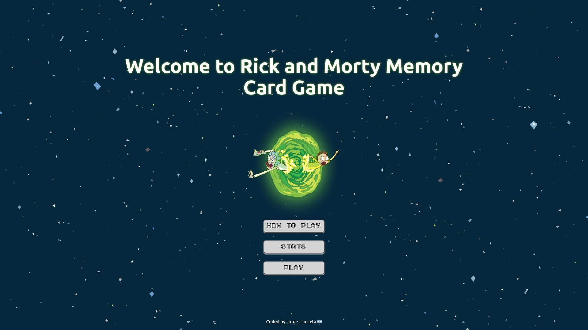
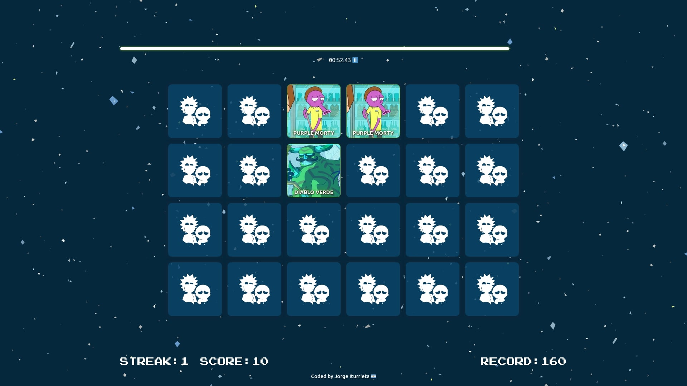

# Rick and Morty Memory Card

This aplication is a challenge for the Hackathon of [Gentleman Programming](https://www.youtube.com/c/GentlemanProgramming).

## What this application is about?

This application is about Memory Card Game.
The object of the game is to collect the most matching pairs of cards.
The player chooses a card , then selects another card and, if the two cards are a matching pair, the two cards will be on the board.
If the cards are not a match they are turned back over.

## How to run the App ?

You need to run the following commands.

`yarn install`

`yarn dev`

## Screenshot

### Home

### Stage

## Live Demo

## Author

Iturrieta Jorge
